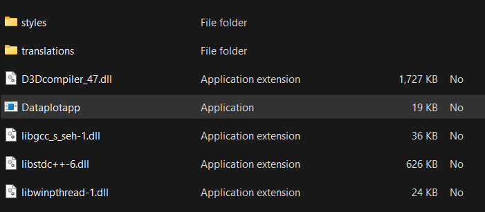

This is a repository of Qt app which takes the 2 columns xlsx / csv file from user& plots the graph.

* To install the App click on the 'Dataplotapp' application file.

* Extract the files if prompted.

* Run the Application file